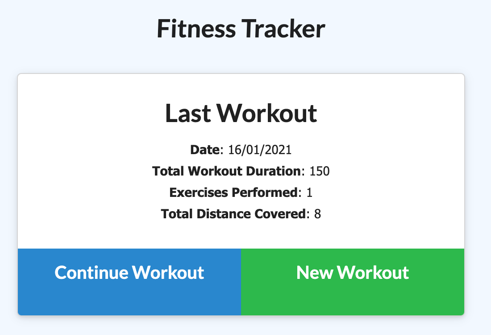

# Workout Tracker 
  Application to track workouts.

  Deployed at [heroku](https://lit-sierra-58501.herokuapp.com/)
  # Table of Contents
  1. [Installation](#installation)
  2. [Usage](#usage)
  3. [License](#license)
  4. [Contribution Guidelines](#contribution-guidelines)
  5. [Questions](#questions)
## Installation
To install : 
fork and clone this repo

It supposed to have mongodb already installed on your machine
 run `npm i`, then run `npm start`
## Usage
You can either add exercises to last workout or create new one

Also you can see statistics for last seven days:

`Add resistance or cardio exercise`
## License
[License: MIT](https://opensource.org/licenses/MIT)
## Contribution Guidelines 
contact me

## Questions
For questionts please contact [me](https://github.com/Myau5x) at ola.illari@gmail.com
 

